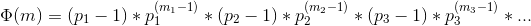

S-99: Ninety-Nine Scala Problems
================================
The problems have different levels of difficulty. Unmarked problems are easy. If you have successfully solved the preceeding problems you should be able to solve them within a few (say 15) minutes. Problems marked with a warning :warning: are of intermediate difficulty. If you are a skilled Scala programmer it shouldn't take you more than 30-90 minutes to solve them. Problems marked with to exclamation marks :bangbang: are more difficult. You may need more time (i.e. a few hours or more) to find a good solution. The difficulties were all assigned for the Prolog problems, but the Scala versions seem to be of roughly similar difficulty.

Your goal should be to find the most elegant solution of the given problems. Efficiency is important, but clarity is even more crucial. 

- [Lists](#lists) (1-28)
- [Arithmetic](#arithmetic) (31-41)
- [Logic and Codes](#logic-and-codes) (46-50)
- [Binary Trees](#binary-trees) (55-69)
- [Multiway Trees](#multiway-trees) (70-73)
- [Graphs](#graphs) (80-89)
- [Puzzles](#puzzles) (90-99)
  - Eight queens problem
  - Knight's tour
  - Von Koch's conjecture
  - An Arithmetic puzzle
  - Generate K-regular simple graphs with N nodes
  - English number words
  - Syntax checker
  - Sudoku
  - Nonograms
  - Crossword puzzle

Lists
-----
The first section contains easy problems around working with and manipulating lists. In many cases, there is more than one reasonable approach. Some of the problems can be solved easily by using solutions to previous problems. Also, some of the (easy) problems can be trivially solved using built-in functions. However, in these cases, you learn more if you try to find your own solution.

### P01 Find the last element of a list
Example:
```scala
scala> last(List(1, 1, 2, 3, 5, 8))
res0: Int = 8
```

### P02 Find the last but one element of a list
Example:
```scala
scala> penultimate(List(1, 1, 2, 3, 5, 8))
res0: Int = 5
```

### P03 Find the Kth element of a list
By convention, the first element in the list is element 0. Example:
```scala
scala> nth(2, List(1, 1, 2, 3, 5, 8))
res0: Int = 2
```

### P04 Find the number of elements of a list
Example:
```scala
scala> length(List(1, 1, 2, 3, 5, 8))
res0: Int = 6
```

### P05 Reverse a list
Example:
```scala
scala> reverse(List(1, 1, 2, 3, 5, 8))
res0: List[Int] = List(8, 5, 3, 2, 1, 1)
```

### P06 Find out whether a list is a palindrome
A list is a palindrome if it reads the same backwards as forwards. Example:
```scala
scala> isPalindrome(List(1, 2, 3, 2, 1))
res0: Boolean = true
```

### P07:warning: Flatten a nested list structure
Example:
```scala
scala> flatten(List(List(1, 1), 2, List(3, List(5, 8))))
res0: List[Any] = List(1, 1, 2, 3, 5, 8)
```

### P08:warning: Eliminate consecutive duplicates of list elements
If a list contains repeated elements they should be replaced with a single copy of the element. The order of the elements should not be changed. Example:
```scala
scala> compress(List('a, 'a, 'a, 'a, 'b, 'c, 'c, 'a, 'a, 'd, 'e, 'e, 'e, 'e))
res0: List[Symbol] = List('a, 'b, 'c, 'a, 'd, 'e)
```

### P09:warning: Pack consecutive duplicates of list elements into sublists
If a list contains repeated elements they should be placed in separate sublists. Example:
```scala
scala> pack(List('a, 'a, 'a, 'a, 'b, 'c, 'c, 'a, 'a, 'd, 'e, 'e, 'e, 'e))
res0: List[List[Symbol]] = List(List('a, 'a, 'a, 'a), List('b), List('c, 'c), List('a, 'a), List('d), List('e, 'e, 'e, 'e))
```

### P10 Run-length encoding of a list
Use the result of P09 to implement the so-called run-length encoding data compression method. Consecutive duplicates of elements are encoded as tuples `(N, E)` where `N` is the number of duplicates of the element `E`. Example:
```scala
scala> encode(List('a, 'a, 'a, 'a, 'b, 'c, 'c, 'a, 'a, 'd, 'e, 'e, 'e, 'e))
res0: List[(Int, Symbol)] = List((4,'a), (1,'b), (2,'c), (2,'a), (1,'d), (4,'e))
```

### P11 Modified run-length encoding
Modify the result of P10 in such a way that if an element has no duplicates it is simply copied into the result list. Only elements with duplicates are transferred as `(N, E)` terms. Example:
```scala
scala> encodeModified(List('a, 'a, 'a, 'a, 'b, 'c, 'c, 'a, 'a, 'd, 'e, 'e, 'e, 'e))
res0: List[Any] = List((4,'a), 'b, (2,'c), (2,'a), 'd, (4,'e))
```

### P12:warning: Decode a run-length encoded list
Given a run-length code list generated as specified in P10, construct its uncompressed version. Example:
```scala
scala> decode(List((4, 'a), (1, 'b), (2, 'c), (2, 'a), (1, 'd), (4, 'e)))
res0: List[Symbol] = List('a, 'a, 'a, 'a, 'b, 'c, 'c, 'a, 'a, 'd, 'e, 'e, 'e, 'e)
```

### P13:warning: Run-length encoding of a list (direct solution)
Implement the so-called run-length encoding data compression method directly. I.e. don't use other methods you've written (like P09's pack); do all the work directly. Example:
```scala
scala> encodeDirect(List('a, 'a, 'a, 'a, 'b, 'c, 'c, 'a, 'a, 'd, 'e, 'e, 'e, 'e))
res0: List[(Int, Symbol)] = List((4,'a), (1,'b), (2,'c), (2,'a), (1,'d), (4,'e))
```

### P14 Duplicate the elements of a list
Example:
```scala
scala> duplicate(List('a, 'b, 'c, 'c, 'd))
res0: List[Symbol] = List('a, 'a, 'b, 'b, 'c, 'c, 'c, 'c, 'd, 'd)
```

### P15:warning: Duplicate the elements of a list a given number of times
Example:
```scala
scala> duplicateN(3, List('a, 'b, 'c, 'c, 'd))
res0: List[Symbol] = List('a, 'a, 'a, 'b, 'b, 'b, 'c, 'c, 'c, 'c, 'c, 'c, 'd, 'd, 'd)
```

### P16:warning: Drop every Nth element from a list
Example:
```scala
scala> drop(3, List('a, 'b, 'c, 'd, 'e, 'f, 'g, 'h, 'i, 'j, 'k))
res0: List[Symbol] = List('a, 'b, 'd, 'e, 'g, 'h, 'j, 'k)
```

### P17 Split a list into two parts
The length of the first part is given. Use a Tuple for your result. Example:
```scala
scala> split(3, List('a, 'b, 'c, 'd, 'e, 'f, 'g, 'h, 'i, 'j, 'k))
res0: (List[Symbol], List[Symbol]) = (List('a, 'b, 'c),List('d, 'e, 'f, 'g, 'h, 'i, 'j, 'k))
```

### P18:warning: Extract a slice from a list
Given two indices, `I` and `K`, the slice is the list containing the elements from and including the `I`th element up to but not including the `K`th element of the original list. Start counting the elements with 0. Example:
```scala
scala> slice(3, 7, List('a, 'b, 'c, 'd, 'e, 'f, 'g, 'h, 'i, 'j, 'k))
res0: List[Symbol] = List('d, 'e, 'f, 'g)
```

### P19:warning: Rotate a list N places to the left
Examples:
```scala
scala> rotate(3, List('a, 'b, 'c, 'd, 'e, 'f, 'g, 'h, 'i, 'j, 'k))
res0: List[Symbol] = List('d, 'e, 'f, 'g, 'h, 'i, 'j, 'k, 'a, 'b, 'c)

scala> rotate(-2, List('a, 'b, 'c, 'd, 'e, 'f, 'g, 'h, 'i, 'j, 'k))
res1: List[Symbol] = List('j, 'k, 'a, 'b, 'c, 'd, 'e, 'f, 'g, 'h, 'i)
```

### P20 Remove the Kth element from a list
Return the list and the removed element in a Tuple. Elements are numbered from 0. Example:
```scala
scala> removeAt(1, List('a, 'b, 'c, 'd))
res0: (List[Symbol], Symbol) = (List('a, 'c, 'd),'b)
```

### P21 Insert an element at a given position into a list
Example:
```scala
scala> insertAt('new, 1, List('a, 'b, 'c, 'd))
res0: List[Symbol] = List('a, 'new, 'b, 'c, 'd)
```

### P22 Create a list containing all integers within a given range
Example:
```scala
scala> range(4, 9)
res0: List[Int] = List(4, 5, 6, 7, 8, 9)
```

### P23:warning: Extract a given number of randomly selected elements from a list
:bulb: **Hint:** Use the solution to P20. Example:
```scala
scala> randomSelect(3, List('a, 'b, 'c, 'd, 'f, 'g, 'h))
res0: List[Symbol] = List('e, 'd, 'a)
```

### P24 Lotto: Draw N different random numbers from the set 1..M
Example:
```scala
scala> lotto(6, 49)
res0: List[Int] = List(23, 1, 17, 33, 21, 37)
```

### P25 Generate a random permutation of the elements of a list
:bulb: **Hint:** Use the solution of P23. Example:
```scala
scala> randomPermute(List('a, 'b, 'c, 'd, 'e, 'f))
res0: List[Symbol] = List('b, 'a, 'd, 'c, 'e, 'f)
```

### P26:warning: Generate the combinations of K distinct objects chosen from the N elements of a list
In how many ways can a committee of 3 be chosen from a group of 12 people? There are `C(12,3) = 220` possibilities, whereas `C(N,K)` denotes the [binomial coefficient](https://en.wikipedia.org/wiki/Binomial_coefficient). For pure mathematicians, this result may be great. But we want to really generate all the possibilities. Example:
```scala
scala> combinations(3, List('a, 'b, 'c, 'd, 'e, 'f))
res0: List[List[Symbol]] = List(List('a, 'b, 'c), List('a, 'b, 'd), List('a, 'b, 'e), ...
```

### P27:warning: Group the elements of a set into disjoint subsets
**a)** In how many ways can a group of 9 people work in 3 disjoint subgroups of 2, 3 and 4 persons? Write a function that generates all the possibilities. Example:
```scala
scala> group3(List("Aldo", "Beat", "Carla", "David", "Evi", "Flip", "Gary", "Hugo", "Ida"))
res0: List[List[List[String]]] = List(List(List(Aldo, Beat), List(Carla, David, Evi), List(Flip, Gary, Hugo, Ida)), ...
```
**b)** Generalize the above predicate in a way that we can specify a list of group sizes and the predicate will return a list of groups. Example:
```scala
scala> group(List(2, 2, 5), List("Aldo", "Beat", "Carla", "David", "Evi", "Flip", "Gary", "Hugo", "Ida"))
res0: List[List[List[String]]] = List(List(List(Aldo, Beat), List(Carla, David), List(Evi, Flip, Gary, Hugo, Ida)), ...
```
Note that we do not want permutations of the group members; i.e. `((Aldo, Beat), ...)` is the same solution as `((Beat, Aldo), ...)`. However, we make a difference between `((Aldo, Beat), (Carla, David), ...)` and `((Carla, David), (Aldo, Beat), ...)`.

:information_source: You may find more about this combinatorial problem in a good book on discrete mathematics under the term [*multinomial coefficients*](https://en.wikipedia.org/wiki/Multinomial_theorem#Multinomial_coefficients).

### P28:warning: Sorting a list of lists according to length of sublists
**a)** We suppose that a list contains elements that are lists themselves. The objective is to sort the elements of the list according to their length. E.g. short lists first, longer lists later, or vice versa. Example:
```scala
scala> lsort(List(List('a, 'b, 'c), List('d, 'e), List('f, 'g, 'h), List('d, 'e), List('i, 'j, 'k, 'l), List('m, 'n), List('o)))
res0: List[List[Symbol]] = List(List('o), List('d, 'e), List('d, 'e), List('m, 'n), List('a, 'b, 'c), List('f, 'g, 'h), List('i, 'j, 'k, 'l))
```
**b)** Again, we suppose that a list contains elements that are lists themselves. But this time the objective is to sort the elements according to their length frequency; i.e. in the default, sorting is done ascendingly, lists with rare lengths are placed, others with a more frequent length come later. Example:
```scala
scala> lsortFreq(List(List('a, 'b, 'c), List('d, 'e), List('f, 'g, 'h), List('d, 'e), List('i, 'j, 'k, 'l), List('m, 'n), List('o)))
res1: List[List[Symbol]] = List(List('i, 'j, 'k, 'l), List('o), List('a, 'b, 'c), List('f, 'g, 'h), List('d, 'e), List('d, 'e), List('m, 'n))
```
Note that in the above example, the first two lists in the result have length 4 and 1 and both lengths appear just once. The third and fourth lists have length 3 and there are two list of this length. Finally, the last three lists have length 2. This is the most frequent length.

Arithmetic
----------
For the next section, we're going to take a different tack with the solutions. We'll declare a new class, `S99Int`, and an implicit conversion from regular `Int`s. Solutions will either be in a form of an additional `S99Int` method (then available as operations on `Int`s via implicit conversion), or a static method on the companion object.

### P31:warning: Determine whether a given integer number is prime
A [prime number](https://en.wikipedia.org/wiki/Prime_number) is a natural number `N > 1` that has no positive divisors other than 1 and itself. Example:
```scala
scala> 7.isPrime
res0: Boolean = true
```

### P32:warning: Determine the greatest common divisor of two positive integer numbers
The greates common divisor ([GCD](https://en.wikipedia.org/wiki/Greatest_common_divisor)) is the largest positive integer that divides both numbers without a remainder. Use [Euclid's algorithm](https://xlinux.nist.gov/dads/HTML/euclidalgo.html) ([Wikipedia](https://en.wikipedia.org/wiki/Greatest_common_divisor#Using_Euclid.27s_algorithm)). Example:
```scala
scala> gcd(36, 63)
res0: Int = 9
```

### P33 Determine whether two positive integer numbers are coprime
Two numbers are [coprime](https://en.wikipedia.org/wiki/Coprime_integers) if their greatest common divisor equals 1. Example:
```scala
scala> 35.isCoprimeTo(64)
res0: Boolean = true
```

### P34:warning: Calculate Euler's totient function ϕ(m)
Euler's [totient function](https://en.wikipedia.org/wiki/Euler%27s_totient_function) `ϕ(m)` is defined as the number of positive integers `r` `(1 <= r <= m)` that are coprime to `m`. Example:
```scala
scala> 10.totient
res0: Int = 4

```

### P35:warning: Determine the prime factors of a given positive integer
Construct a flat list containing the prime factors in ascending order. Example:
```scala
scala> 315.primeFactors
res0: List[Int] = List(3, 3, 5, 7)
```

### P36:warning: Determine the prime factors of a given positive integer
Construct a list containing the prime factors and their multiplicity. Example:
```scala
scala> 315.primeFactorMultiplicity
res0: List[(Int, Int)] = List((3,2), (5,1), (7,1))
```

### P37:warning: Calculate Euler's totient function ϕ(https://github.com/jchoffmann/ninety-nine-scala-problems.gitm) (improved)
See P34 for the definition of Euler's totient function. If the list of the prime factors of a number m is known in the form of P36 then the function `ϕ(m)` can be efficiently calculated as follows: Let `[[p1, m1], [p2, m2], [p3, m3], ...]` be the list of prime factors (and their multiplicities) of a given number `m`. Then `ϕ(m)` can be calculated with the following formula:



Example:
```scala
scala> 10.totientImproved
res0: Int = 4
```

### P38 Compare the two methods of calculating Euler's totient function
Use the solutions of P34 and P37 to compare the algorithms. Try to calculate `ϕ(10090)` as an example.

### P39 A list of prime numbers
Given a range of integers by its lower and upper limit, construct a list of all prime numbers in that range. Example:
```scala
scala> listPrimesinRange(7 to 31)
res0: List[Int] = List(7, 11, 13, 17, 19, 23, 29, 31)
```

### P40:warning: Goldbach's conjecture
[Goldbach's conjecture](https://en.wikipedia.org/wiki/Goldbach%27s_conjecture) says that every positive even number greater than 2 is the sum of two prime numbers. E.g. `28 = 5 + 23`. It is one of the most famous facts in number theory that has not been proved to be correct in the general case. It has been numerically confirmed up to very large numbers (much larger than Scala's Int can represent). Write a function to find the two prime numbers that sum up to a given even integer. Example:
```scala
scala> 28.goldbach
res0: (Int, Int) = (5,23)
```

### P41:warning: A list of Goldbach compositions
Given a range of integers by its lower and upper limit, return a Map of all even numbers and their Goldbach composition. For example, these are the Goldbach compositions between 9 and 20:
```
10 = 3 + 7
12 = 5 + 7
14 = 3 + 11
16 = 3 + 13
18 = 5 + 13
20 = 3 + 17
```
```scala
scala> goldbachList(9 to 20)
res0: Map[Int,(Int, Int)] = Map(10 -> (3,7), 14 -> (3,11), 20 -> (3,17), 12 -> (5,7), 18 -> (5,13), 16 -> (3,13))
```

### P42:warning: A list of Goldbach compositions with a given minimum value
In most cases, if an even number is written as the sum of two prime numbers, one of them is very small. Very rarely, the primes are both bigger than, say, 50. Write a version of P41 where each of the two prime numbers are bigger than a given minimum. For example, these are the Goldbach compositions between 1 and 2000 where each prime is bigger than 50:
```
992 = 73 + 919
1382 = 61 + 1321
1856 = 67 + 1789
1928 = 61 + 1867
```
```scala
scala> goldbachListLimited(1 to 2000, 50)
res6: Map[Int,(Int, Int)] = Map(992 -> (73,919), 1382 -> (61,1321), 1856 -> (67,1789), 1928 -> (61,1867))
```
Try to find out how many such cases there are in the range 2..3000.

Logic and Codes
---------------
Similar to the previous section, we will declare a new class, `S99Logic`, and an implicit conversion from regular `Boolean`s. Solutions will either be in a form of an additional `S99Logic` method (then available as operations on `Boolean`s via implicit conversion), or a static method on the companion object.

### P46:warning: Truth tables for logical expressions
**a)** Define functions `and`, `or`, `nand`, `nor`, `xor`, `impl`, and `equ` (for logical equivalence) which return `true` or `false` according to the result of their respective operations; e.g. `and(A, B)` is `true` if and only if both `A` and `B` are `true`. Don't use builtin operations. Examples:
```scala
scala> and(true, true)
res0: Boolean = true

scala> xor(true, true)
res1: Boolean = false
```
:bulb: **Hint:** Define fundamental operations `not`, `and`, `or` in terms of pattern matching, and the other functions in terms the fundamental ones.

**b)** Write a function `table2` that takes as input a logical operation in two variables as defined above, and returns a Map representing the truth table of that operation. Example truth table for the expression `A and (A or B)`:

| A     | B     | A and (A or B) |
|-------|-------|----------------|
| true  | true  | true           |
| true  | false | true           |
| false | true  | false          |
| false | false | false          |
```scala
scala> table2((a, b) => and(a, or(a, b)))
res0: Map[(Boolean, Boolean),Boolean] = Map((false,false) -> false, (false,true) -> false, (true,false) -> true, (true,true) -> true)
```

### P47 Logical functions as operators
Continue P46 by redefining `and`, `or` etc. as operators, i.e. add them as methods to `S99Logic`. `not` will have to be left as an object method. Example for the expression `A and (A or ¬B)`:

| A     | B     | A and (A or ¬B) |
|-------|-------|-----------------|
| true  | true  | true            |
| true  | false | true            |
| false | true  | false           |
| false | false | false           |
```scala
scala> table2((a, b) => a and (a or not(b)))
res0: Map[(Boolean, Boolean),Boolean] = Map((false,false) -> false, (false,true) -> false, (true,false) -> true, (true,true) -> true)
```

### P49:warning: Gray code
An n-bit [Gray code](https://en.wikipedia.org/wiki/Gray_code) is, for the purpose of this exercise, an ordered sequence of n-bit strings where two successive strings differ in one bit only. For example:
```scala
n = 1: C(1) = ("0", "1")
n = 2: C(2) = ("00", "01", "11", "10")
n = 3: C(3) = ("000", "001", "011", "010", "110", "111", "101", "100")
```
Find out the construction rules and write a function to generate n-bit Gray codes. Example:
```scala
scala> gray(3)
res0 List[String] = List(000, 001, 011, 010, 110, 111, 101, 100)
```
:bulb: **Hint:** In the example above, given the list for `n=1` as starting point, what operations will generate the list for `n=2`? The same operations applied to `n=2` should yield the list for `n=3`. This can be used as a recursive solution.

See if you can use memoization to make the function more efficient.

### P50:bangbang: Huffman code
A [Huffmann code](https://en.wikipedia.org/wiki/Huffman_coding) is a variable length binary code that is a certain sense optimal. Its application is lossless data compression.

Given a set of symbols (e.g. characters) together with their frequencies of occurrence, one can construct a Huffmann tree, which in turn can be used to determine the binary string representing the Huffmann code for each symbol. More common symbols are generelly represented using fewer bits than less common symbols. For example:

| Symbol | Frequency | Huffmann code |
|--------|-----------|---------------|
| a      | 45        | 0             |
| b      | 13        | 101           |
| c      | 12        | 100           |
| d      | 16        | 111           |
| e      | 9         | 1101          |
| f      | 5         | 1100          |

Using these codes, the word `cafe` would be represented as `100011001101`.

Figure out how the Huffmann tree works and how the Huffmann code for each symbol can be generated. The objective is to write a function that takes a list of `(S, F)` tuples with `S` being a symbol and `F` its frequency, and returns a list of `(S, C)` tuples where `S` is a symbol and `C` the Huffmann code word for it. Example:
```scala
scala> huffman(List(("a", 45), ("b", 13), ("c", 12), ("d", 16), ("e", 9), ("f", 5)))
res0: List[String, String] = List((a,0), (b,101), (c,100), (d,111), (e,1101), (f,1100))
```

Binary Trees
------------
A [binary tree](https://en.wikipedia.org/wiki/Binary_tree) is either empty, or it is composed of a root element and two children, which are binary trees themselves. We will use the following class hierarchy to represent binary trees:
```scala
sealed abstract class Tree[+T] { ... }

case class Node[+T](value: T, left: Tree[T], right: Tree[T]) extends Tree[T] { ... }

case object End extends Tree[Nothing] { ... }
```
`End` represents the empty tree. `Node` represents a root element with two children, and it also holds a certain value. The companion object for `Node` defines a shortcut to construct a leaf node (i.e. the children are empty trees): `Node(value)` is equivalent to `Node(value, End, End)`.

For example the following tree:


is given by
```scala
scala> Node('a',
            Node('b', Node('d'), Node('e')),
            Node('c', End, Node('f', Node('g'), End)))
res0: Node[Char] = T(a T(b T(d . .) T(e . .)) T(c . T(f T(g . .) .)))
```
The `toString` representation of `End` is a dot, whereas `Node(value, left, right)` is printed as `T(value x y)` where `x` and `y` are the `toString` representations of the children.

In this section, we will be adding methods to the above classes or their companion objects.

:information_source: `Tree` is parameterized i.e. it can hold values of arbitrary type `T`. Declaring the type as `+T` makes `Tree` *covariant*, which means it will be able to hold subtypes of whatever type it was created for. This is also necessary for `End` to be a singleton object, because it must have a specific type. Its type is `Nothing`, which is a subtype of every other type.

### P55:warning: Construct completely balanced binary trees
In a completely balanced binary tree, the following property holds for every node: The number of nodes in its left sub-tree and the number of nodes in its right sub-tree are almost equal, which means their difference is not greater than one.

Write a function `completelyBalancedTrees` to generate all completely balanced binary trees for a given number of nodes. The function should take as parameters the number of nodes and a single value to put in all of them, and return the list of all solutions. Example:
```scala
scala> completelyBalancedTrees(4, "x")
res0: List[Tree[String]] = List(T(x T(x . .) T(x . T(x . .))), T(x T(x . T(x . .)) T(x . .)), T(x T(x . .) T(x T(x . .) .)), T(x T(x T(x . .) .) T(x . .)))
```
:bulb: **Hint:** Try to find a recursive formulation

### P56:warning: Symmetric binary trees
A binary tree is symmetric if you can draw a vertical line through the root node and then the right sub-tree is the mirror image of the left sub-tree. Add an `isSymmetric` method to check whether a given binary tree is symmetric. Example:
```scala
scala> Node('a', Node('b'), Node('c')).isSymmetric
res0: Boolean = true
```

:bulb: **Hint:** Write an `isMirrorOf` method first to check whether one tree is the mirror image of another. We are only interested in the structure, not in the contents of the nodes.

### P57:warning: Construct symmetric, completely balanced binary trees
Use P55 and P56 to construct all symmetric, completely balanced binary trees with a given number of nodes. Example:
```scala
scala> symmetricBalancedTrees(5, "x")
res0: List[Node[String]] = List(T(x T(x . T(x . .)) T(x T(x . .) .)), T(x T(x T(x . .) .) T(x . T(x . .))))
```

### P58:warning: Construct binary search trees (dictionaries)
A [binary search tree](https://en.wikipedia.org/wiki/Binary_search_tree) is a binary tree, that satisfies the additional property that the value of a node must be greater than all values in the left sub-tree, and not greater than all values in the right sub-tree. This means that a binary search tree requires an ordering such that two values can be compared. Its advantage is that sorting and searching can be very efficient. 

**a)** Write a function `addValue` to add an element to a binary search tree, preserving its properties. Example:
```scala
scala> End.addValue(2)
res0: Node[Int] = T(2 . .)

scala> res0.addValue(3)
res1: Node[Int] = T(2 . T(3 . .))

scala> res1.addValue(0)
res2: Node[Int] = T(2 T(0 . .) T(3 . .))
```
Its signature should be
```scala
def addValue[U >: T](x: U)(implicit o: U => Ordered[U]): Tree[U]
```
It is parameterized by `>: T` because its parameter `x` needs to be contravariant in `T`. Conceptually, we're adding nodes on top of existing nodes, and in order for the existing nodes to be of type `T` or any subtype, the added nodes must be of type `T` or any supertype.

The implicit parameter provides the ordering required to compare values of type `T`. A number of standard orderings exist and will be provided automatically, e.g. for type `Int`.

**b)** Using the above function, write a new function `fromList` to construct a binary tree from a list of integers. Example:
```scala
scala> fromList(List(3, 2, 5, 7, 1))
res0: Node[Int] = T(3 T(2 T(1 . .) .) T(5 . T(7 . .)))
```
Use the new function to test your solution to P56:
```scala
scala> fromList(List(5, 3, 18, 1, 4, 12, 21)).isSymmetric
res0: Boolean = true

scala> fromList(List(3, 2, 5, 7, 4)).isSymmetric
res1: Boolean = false
```

### P59:warning: Construct height-balanced binary trees with a given height
We will introduce a few definitions:
* the [**depth**](https://xlinux.nist.gov/dads/HTML/depth.html) of a node is its distance (number of edges) to the root node; depth of the root is 0
* the **height** of a node is the maximum distance (number of edges) between that node and a leaf
* the [**height**](https://xlinux.nist.gov/dads/HTML/height.html) of a tree is the height of its root, or equivalently, the maximum depth of any node; a tree consisting of a root node only has height 0

**a)** Write a function `height` that returns the height of a tree (height of the empty tree is -1 for the purpose of this exercise). Example:
```scala
scala> Node("x", Node("x"), End).height
res0: Int = 1
```
**b)** Write a function `heightBalancedTreesWithHeight` to generate all height-balanced binary trees for a given height. The function should take as parameters the height `H` and a single value to put in all of the nodes, and return the list of all solutions. Example:
```scala
scala> heightBalancedTreesWithHeight(2, "x")
res0: List[Tree[String]] = List(T(x T(x T(x . .) T(x . .)) T(x T(x . .) T(x . .))), T(x T(x T(x . .) T(x . .)) T(x T(x . .) .)), ...
```
:bulb: **Hint:** You don't necessarily need to use `height` for `heightBalancedTreesWithHeight`. Try to find a recursive formulation.

### P60:warning: Construct height-balanced binary trees with a given number of nodes
In order to achieve our goal, we will introduce a few functions first to deepen the understanding between the number of nodes and the height, some of which might be useful for the final solution.

**a)** Write a function `nodeCount` that returns the number of nodes in a binary tree. Example:
```scala
scala> Node('x, End, Node('x)).nodeCount
res0: Int = 2
```
**b)** What is the maximum number of nodes a height-balanced binary tree of height `H` can have? (it is the same as the maximum number of nodes any binary tree can have). Write a function `maxHbalNodes` that returns this number. Example:
```scala
scala> maxHbalNodes(2)
res0: Int = 7
```
**c)** What is the minimum number of nodes a height-balanced binary tree of height `H` can have? This question is more difficult. Try to find a recursive statement and turn it into a function `minHbalNodes` that returns this number. Example:
```scala
scala> minHbalNodes(2)
res0: Int = 4
```
**d)** What is the maximum height a height-balanced binary tree with `N` nodes can have? Write a function `maxHbalHeight` that returns this number. Example:
```scala
scala> maxHbalHeight(4)
res0: Int = 2
```
**e)** What is the minimum height a height-balanced binary tree with `N` nodes can have? Try to find a recursive statement and turn it into a function `minHbalHeight` that returns this number. Example:
```scala
scala> minHbalHeight(4)
res0: Int = 2
```
**f)** Now we can attack the main problem. Using some of the existing functions, write a function `heightBalancedTreesWithNodes` that takes as parameters the number of nodes `N` and a single value to put in all of the nodes, and return the list of all solutions. Example:
```scala
scala> heightBalancedTreesWithNodes(4, "x")
res0: List[Tree[String]] = List(T(x T(x T(x . .) .) T(x . .)), T(x T(x . .) T(x T(x . .) .)), ...
```
Find out how many height-balanced trees exist for `N = 15`.

### P61 Leaves of a binary tree
A **leaf** is a node with no successors.

**a)** Write a method `leafList` to collect them in a list. Example:
```scala
scala> Node('a', Node('b'), Node('c', Node('d'), Node('e'))).leafList
res0: List[Char] = List(b, d, e)
```
**b)** Write a method `leafCount` to count all leaves. Example:
```scala
scala> Node('x', Node('x'), End).leafCount
res0: Int = 1
```

### P62 Nodes of a binary tree
An **internal node** of a binary tree has either one or two non-empty successors. 

**a)** Write a method `internalList` to collect them in a list. Example:
```scala
scala> Node('a', Node('b'), Node('c', Node('d'), Node('e'))).internalList
res0: List[Char] = List(a, c)
```
**b)** A node of a binary tree is at level `N` if the path from the root to the node has length `N-1`. The root node is at level 1. Write a method `atLevel` to collect all nodes at a given level in a list. Example:
```scala
scala> Node('a', Node('b'), Node('c', Node('d'), Node('e'))).atLevel(2)
res0: List[Char] = List(b, c)
```
:information_source: Using `atLevel` it is easy to construct a method `levelOrder` which creates the level-order sequence of the nodes. However, there are more efficient ways to do that.

### P63:warning: Construct a complete binary tree
A **complete binary tree** with height `H` contains the maximum number of nodes at each level (i.e. 2<sup>(i-1)</sup> at level i). In level `H`, which may contain less than the maximum possible number of nodes, all the nodes are left-adjusted. This means that in a level-order traversal, all internal nodes come first, then the leaves, and finally the empty successors.

We can now assign an address to each node by enumerating them in level-order starting with 1. For any node we observe the following property: Given its address `A`, the address of its left successor is `2A`, and the address of its right successor is `2A+1` (provided they exist).

This fact can be used to elegantly construct a complete binary tree. Write a method `completeBinaryTree` that takes as paraneters the numbers of nodes `N` and a single value to put in all of the nodes. Example:
```scala
scala> completeBinaryTree(6, "x")
res0: Tree[String] = T(x T(x T(x . .) T(x . .)) T(x T(x . .) .))
```

### P64:warning: Layout a binary tree (1)
As a preparation for drawing a tree, a layout algorithm is required to determine the position of each node in a rectangular grid. In order to store the position of the nodes, we add a new class with the additional information:
```scala
case class PositionedNode[+T](value: T, left: Tree[T], right: Tree[T], x: Int, y: Int) extends Tree[T]
```
Several layout methods are conceivable. We start with the following:


In this layout strategy, the position of a node `v` is obtained by the following two rules:
* `x(v)` is equal to the position of the node `v` in the inorder sequence
* `y(v)` is equal to the depth of the node `v` in the tree

Write a method `layoutBinaryTree` that turns a tree of normal `Node`s into a tree of `PositionedNode`s according to these rules. Example:
```scala
scala> Node('a', Node('b', End, Node('c')), Node('d')).layoutBinaryTree
res0: Tree[Char] = T[3,1](a T[1,2](b . T[2,3](c . .)) T[4,2](d . .))
```
The pictured tree can be constructed with the help of P58b:
```scala
fromList(List('n','k','m','c','a','h','g','e','u','p','s','q'))
```
Use it to check your code.

### P65:warning: Layout a binary tree (2)
An alternative layout method is the following:


Find out the rules and write a method `layoutBinaryTree2` that turns a tree of normal `Node`s into a tree of `PositionedNode`s. Example:
```scala
scala> Node('a', Node('b', End, Node('c')), Node('d')).layoutBinaryTree2
res0: Tree[Char] = T[3,1](a T[1,2](b . T[2,3](c . .)) T[5,2](d . .))
```
:bulb: **Hint:** Look at the horizontal distance between neighbouring nodes on a given level. It is constant on each level.

The pictured tree can be constructed with the help of P58b:
```scala
fromList(List('n','k','m','c','a','e','d','g','u','p','q'))
```
Use it to check your code.

### P66:bangbang: Layout a binary tree (3)
The last layout strategy is the following:


The method yields a very compact layout while maintaining a certain symmetry in every node. Find out the rules and write a method `layoutBinaryTree3` that turns a tree of normal `Node`s into a tree of `PositionedNode`s. Example:
```scala
scala> Node('a', Node('b', End, Node('c')), Node('d')).layoutBinaryTree3
res0: Tree[Char] = T[2,1](a T[1,2](b . T[2,3](c . .)) T[3,2](d . .))
```
:bulb: **Hint:** Consider the horizontal distance between a node and its successor nodes. How tight can you pack together two subtrees to construct the combined binary tree?

The pictured tree can be constructed with the help of P58b:
```scala
fromList(List('n','k','m','c','a','e','d','g','u','p','q'))
```
Use it to check your code.

TODO P67 - P69

Multiway Trees
--------------
A multiway tree is composed of a root element and a (possibly empty) set of successors which are multiway trees themselves. A multiway tree is never empty. The set of successor trees is sometimes called a forest.

TODO description and image

TODO P70 - P73

Graphs
------
A graph is defined as a set of nodes and a set of edges, where each edge is a pair of nodes.

TODO description and image

TODO P80 - P89

Puzzles
-------
Various puzzles that require designing a solution end to end.

TODO P90 - P99